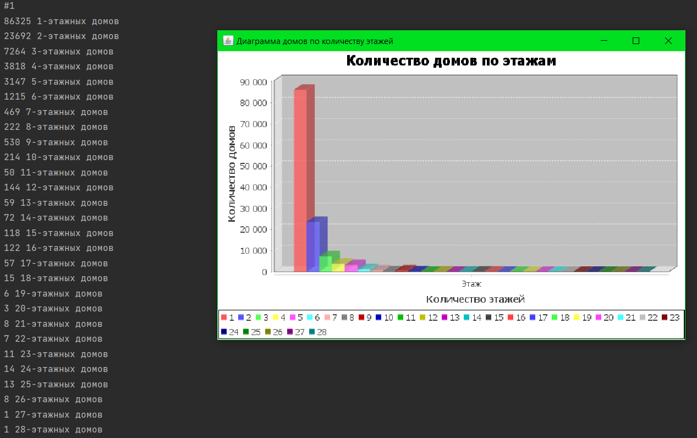
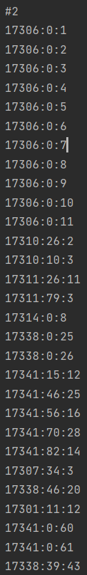
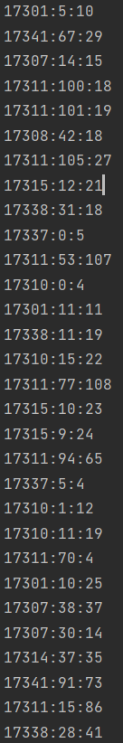
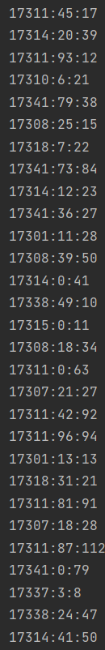
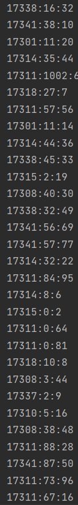
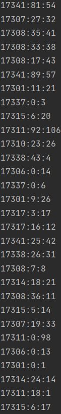
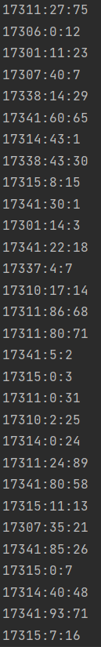
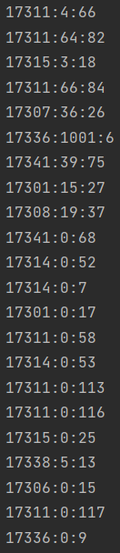
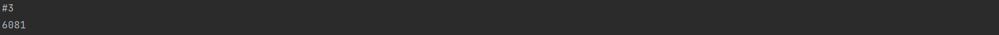

# Итоговый проект по курсу Java

Вариант 1

# Ход работы

1. Проанализировав файл, спроектировал для хранения его данных класс **Building**
2. Распарсил CSV в лист Buildng. Пустые строки и строки "малоэтажный" привел к нижней границе понятия "многоэтажный",
   т.е. к 1 этажу. Так же для "многоэтажный" заменил значения поля на 3.
3. Создал базу данных SQLite с таблицами Buildings и Prefixes, так, чтобы соответствовать 3 нормальной форме и подключил
   к проекту.
4. Для взаимодействия с базой данных создал обработчик Handler, с его помощью заполнил БД распарсенными данными.
*Чтобы ещё раз заполнить БД, раскомментируйте метод ```Handler.fillDB()``` и добавте обработку исключения*
5. Создал класс Task для выполнения заданий через класс Handler.

# Задания
## Задание 1

## Задание 2







## Задание 3
